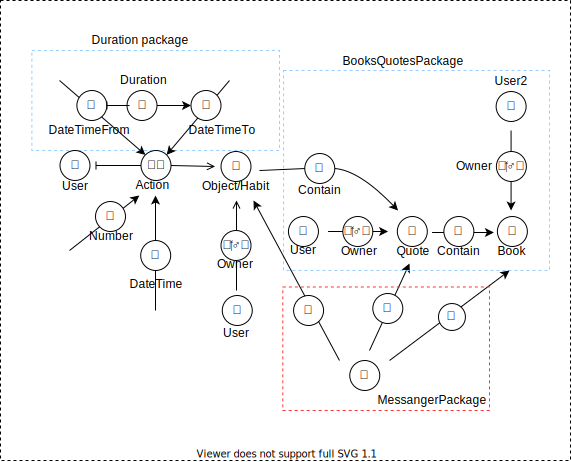

# Deep motive you
Задача: отмечать выполенные дела, привычки, мониторинг показателей (например, веса) и другие objects:
- number: +1 (+1 прогулка утром), -1 (плохо: выкурил сигарету), -0.100 (-100г в весе)
- DateTimeStart, DateTimeEnd -> Duration (Duration package?): Продолжительность занятия делом
- DateTime: информация о том, что дело было выполненно в конкретный день

Каждый вид связей может быть иметь множество экземплятор к одному action и они могут комбинироваться.

